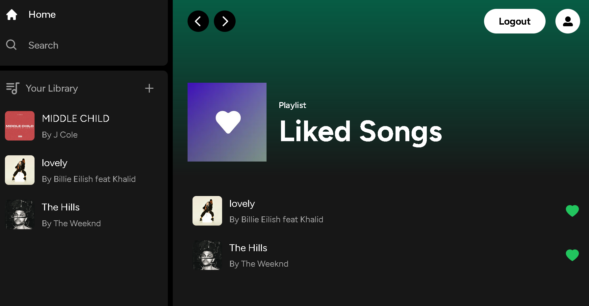
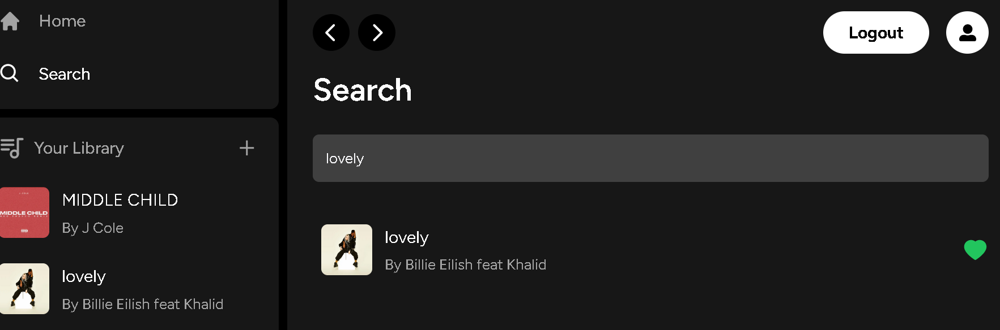
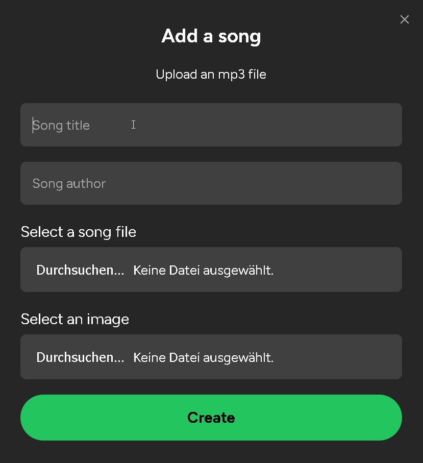
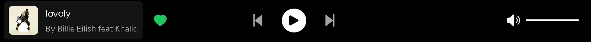
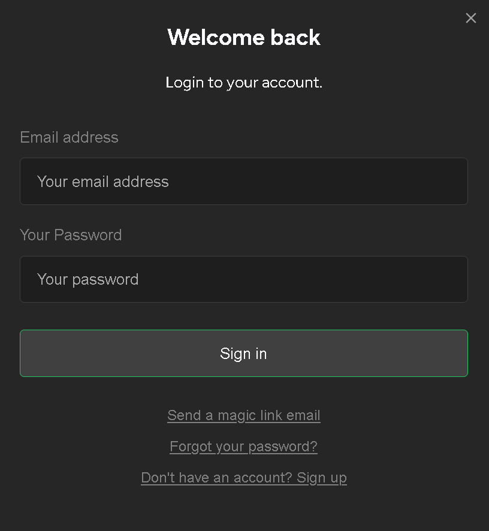

Full Stack Spotify Clone

## Technologies Used: 

## Introduction

## Playlist of Favorites

## Search Function

## Song Upload

## Inbuild Browser Media Player

## Sign up and Log in functionality

This is a repository for a Full Stack Spotify Clone built with Next.js 13.4, utilizing React, Tailwind CSS, Supabase, PostgreSQL. It provides a comprehensive music streaming platform with key features such as song upload, sleek UI design using Tailwind CSS, responsive layout for all devices, authentication with Supabase, file and image upload using Supabase storage, client-side form validation with react-hook-form, server error handling with react-toast, and advanced player component.
Key Features

- Song upload functionality
- Sleek UI design using Tailwind CSS
- Animations and transition effects powered by Tailwind CSS
- Full responsiveness for seamless experience on all devices
- Authentication with Supabase for secure user access
- File and image upload capabilities using Supabase storage
- Client-side form validation and handling using react-hook-form
- Server error handling with react-toast notifications
- Audio player for playing songs
- Favorites system for saving preferred songs
- Playlists and liked songs system for organizing music
- Advanced Player component with enhanced functionality
- Integration with Stripe for recurring payments
- Implementation of POST, GET, and DELETE routes in route handlers (app/api)
- Data fetching in server-side React components by directly accessing the database (without API)
- Handling relations between server and child components in a real-time environment

## Getting Started

To get started with the Full Stack Spotify Clone, follow these steps:

Clone the repository:

	git clone https://github.com/NerminVej/spotify-clone.git

Install dependencies:

	cd spotify-clone
	npm install

Set up your environment variables. Refer to the provided .env.example file and fill in the required values.

Start the development server:

	npm run dev

Open your browser and navigate to http://localhost:3000 to access the application.
